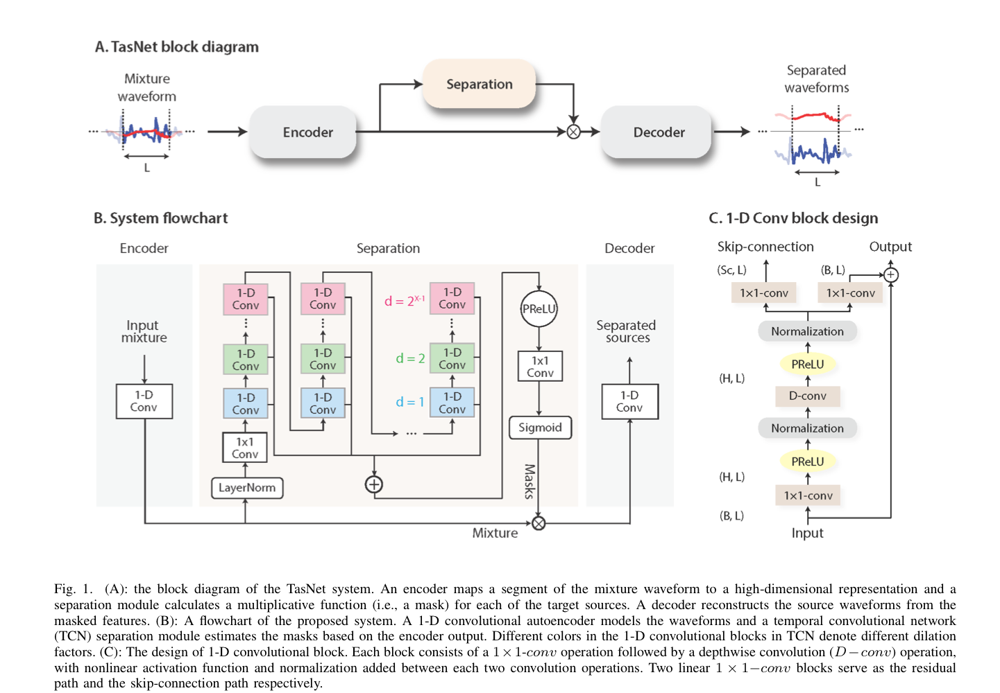

# FAQ

## On normalization
Normalizing waveforms refers to adjusting the **amplitude** of an audio signal to a standard level without altering its other characteristics (like frequency or duration). This is a common preprocessing step in audio-related machine learning tasks.

## GroupNorm
**GroupNorm (Group Normalization)** normalizes input features by dividing channels into $G$ groups and computing the mean and variance within each group. Unlike BatchNorm, it is independent of batch size, making it ideal for small or variable batch sizes. It uses the formula:
$\hat{x}_{i} = \frac{x_i - \mu}{\sqrt{\sigma^2 + \epsilon}}, \quad y_i = \gamma \hat{x}_i + \beta$
where $\gamma$ and $\beta$ are learnable parameters. GroupNorm is effective in tasks like object detection and segmentation, with improved stability over LayerNorm and BatchNorm, though it requires tuning the number of groups ($G$). It's implemented in PyTorch via `nn.GroupNorm`.

## Residual connections
- **Definition:** Residual connections (skip connections) enable networks to learn residual functions $F(x) = H(x) - x$ and output $y = F(x) + x$.
- **Benefits:**
  - Mitigate vanishing gradient problems.
  - Enable training of very deep networks.
  - Improve gradient flow for stable training.
- **Applications:** Commonly used in ResNet, Transformers, U-Net, and other architectures for image and NLP tasks.
- **Key Design Note:** Ensure input and output dimensions match for compatibility.
- **Limitation:** Adds slight computational overhead.

## Why use both residual and skip connections?
Using **both residual and skip connections** in a neural network like Conv-TasNet offers distinct advantages for different purposes. Here's a detailed breakdown of why they are both used:

---

### **1. Residual Connections**
Residual connections are used to help **directly pass features across layers** by adding the input of a layer to its output. 

#### **Purpose of Residual Connections (`self.res_out`)**:
- **Avoid Vanishing Gradients**: By adding the input to the output of a layer, gradients during backpropagation can flow directly through the residual path, avoiding issues of vanishing gradients in very deep networks.
- **Preserve Low-Level Information**: Residual connections preserve low-level information (like raw features) across layers. This is particularly useful when deeper layers modify high-level representations.
- **Stabilize Training**: By providing a shortcut for the input to bypass the transformations in the layer, residual connections reduce the difficulty of optimization, stabilizing training in deep architectures.
- **Incremental Learning**: Residual connections let layers learn **incremental changes** to the input, rather than learning the entire transformation, making optimization more efficient.

#### Example:
```python
residual = input + output_of_layer
```

---

### **2. Skip Connections**
Skip connections **pass outputs of intermediate layers directly to later stages** of the network (bypassing several intermediate layers). They allow the network to merge features at multiple levels of abstraction.

#### **Purpose of Skip Connections (`self.skip_out`)**:
- **Improve Gradient Flow**: Skip connections allow gradients to propagate directly to earlier layers during backpropagation, preventing degradation of learning in deep networks.
- **Combine Features at Multiple Levels**: They aggregate outputs from multiple layers to form a richer representation. For example, early layers may capture local/low-level features (e.g., edges in images or raw waveforms), while deeper layers capture global/high-level features.
- **Enhance Signal Clarity**: In Conv-TasNet, skip connections are aggregated across layers to directly contribute to the final mask output, ensuring that the final result benefits from features learned at every layer.

#### Example:
```python
final_output += skip_output
```

---

### **Why Use Both Together?**

While residual and skip connections share some goals, they achieve **different functionalities**:

| **Aspect**               | **Residual Connections**                                | **Skip Connections**                                |
|--------------------------|-------------------------------------------------------|----------------------------------------------------|
| **Gradient Flow**         | Helps gradients flow through individual layers.        | Helps gradients flow across multiple layers.       |
| **Information Flow**      | Retains low-level information through layers.          | Aggregates multi-scale features from different stages. |
| **Use in Conv-TasNet**    | Improves intermediate feature representation and learning. | Combines outputs of all layers into the final result. |

In **Conv-TasNet**, these two mechanisms work together:
- **Residual connections (`self.res_out`)**: Facilitate incremental learning and ensure efficient propagation of features and gradients within each `ConvBlock`.
- **Skip connections (`self.skip_out`)**: Collect and sum feature outputs from all `ConvBlock` layers to directly influence the final output, improving the model's overall performance.

---

### **Example in Conv-TasNet Context**

```python
residual, skip = conv_block(feats)
if residual is not None:
    feats = feats + residual  # Add residual connection for deeper features
output = output + skip  # Aggregate skip connections for the final result
```

---

### **Summary**
Using both residual and skip connections:
1. **Improves optimization** by stabilizing training and ensuring efficient gradient flow.
2. **Preserves information** at different levels of abstraction (low-level, intermediate, and high-level).
3. **Aggregates features effectively** to improve the model's performance on tasks like speech separation.

Together, they create a robust network architecture capable of handling complex tasks efficiently.

## 1D Convolution
**1D Convolution** applies a sliding kernel over 1D data (e.g., time series, audio) to extract features. It computes the output as:
$$
y_t = \sum_{i=0}^{k-1} w[i] \cdot x[t+i]
$$
where $w$ is the kernel and $x$ is the input. Key parameters include **kernel size**, **stride**, and **padding**. It's efficient for sequential data and used in tasks like signal processing and NLP but needs stacking to capture global patterns.

## Conv Tas Net Architecture

### Summary of Section II: Convolutional Time-domain Audio Separation Network

The **Conv-TasNet** framework is designed for end-to-end speech separation in the time domain, consisting of three main components: **Encoder**, **Separation Module**, and **Decoder**.

1. **Time-domain Speech Separation (II-A):**
   - The speech separation task is framed as estimating multiple source signals $s_1(t), \dots, s_C(t)$ from a single mixed waveform $x(t)$.
   - The model avoids time-frequency transformations like STFT, aiming to estimate sources directly in the time domain for improved accuracy and efficiency.

2. **Convolutional Encoder-Decoder (II-B):**
   - The **Encoder** converts overlapping waveform segments into high-dimensional representations using 1D convolution.
   - The **Decoder** reconstructs waveforms from these representations using 1D transposed convolutions.
   - This structure acts as a **convolutional autoencoder**, ensuring fast training and efficient reconstruction.

3. **Separation Masks (II-C):**
   - The **Separation Module** computes masks $m_i$, which are element-wise multipliers applied to the encoder output to isolate each source.
   - Masks ensure values between 0 and 1 and allow the selective reconstruction of each source waveform.

4. **Convolutional Separation Module (II-D):**
   - Uses **Temporal Convolutional Networks (TCNs)** with dilated 1D convolutional blocks to model long-term dependencies.
   - Features stacked convolutional blocks with increasing dilation factors, residual connections, and depthwise separable convolutions to reduce parameters and improve efficiency.
   - Supports both causal and non-causal configurations, with global or cumulative layer normalization applied depending on the scenario.

The Conv-TasNet framework provides an efficient alternative to traditional STFT-based methods by leveraging convolutional structures to achieve high accuracy with lower latency and smaller model size.

---

## Causal and Non-Causal Configurations with Normalization in Conv-TasNet

**1. Causal vs. Non-Causal Configurations:**
   - **Causal Configuration:**
     - In this setup, the model only uses information from the past and the present (up to the current time step) to make predictions.
     - This is essential for real-time applications like live telecommunication or hearing aids, where future data isn't accessible.
   - **Non-Causal Configuration:**
     - Here, the model can use both past and future information for better predictions.
     - It is suitable for offline processing where access to the entire signal is available, allowing improved accuracy at the cost of latency.

**2. Role of Normalization in Each Configuration:**
   - Normalization helps stabilize training and ensures that the input features are scale-invariant, which is critical for consistent performance across different scenarios.
   - Two types of normalization are employed:
     - **Global Layer Normalization (gLN):**
       - Applies normalization across the entire input sequence (both time and channel dimensions).
       - Used in **non-causal configurations**, as it requires access to the entire input sequence for calculating mean and variance.
       - Formula:
         $$
         gLN(F) = \frac{F - \text{E}[F]}{\sqrt{\text{Var}[F] + \epsilon}} \cdot \gamma + \beta
         $$
         where \( F \) is the feature, \( \text{E}[F] \) and \( \text{Var}[F] \) are the mean and variance computed over time and channel dimensions, \( \gamma \) and \( \beta \) are learnable parameters, and \( \epsilon \) ensures numerical stability.
     - **Cumulative Layer Normalization (cLN):**
       - Normalizes features up to the current time step, making it suitable for **causal configurations**.
       - Ensures that no future information is used in real-time processing.
       - Formula:
         $cLN(f_k) = \frac{f_k - \text{E}[f_{t \leq k}]}{\sqrt{\text{Var}[f_{t \leq k}] + \epsilon}} \cdot \gamma + \beta$
         where $f_k$ is the feature at time step $k$, and normalization is applied only to the data available up to $k$.

**3. Implications:**
   - **Non-Causal (gLN):**
     - Higher separation accuracy due to the availability of full context.
     - Ideal for batch or offline tasks.
   - **Causal (cLN):**
     - Lower separation accuracy but enables real-time processing.
     - Robust for tasks like live speech enhancement.

This adaptability of Conv-TasNet to both configurations with corresponding normalization techniques highlights its versatility for various speech separation applications, balancing between real-time requirements and accuracy.

## Why do we need to resample audio data?
Resampling audio standardizes sampling rates across datasets, aligns with model requirements, reduces computational load, and removes unnecessary frequencies. It ensures compatibility with feature extraction methods, avoids aliasing, and balances efficiency with fidelity, commonly resampling to $16 \, \text{kHz}$ for speech tasks.
